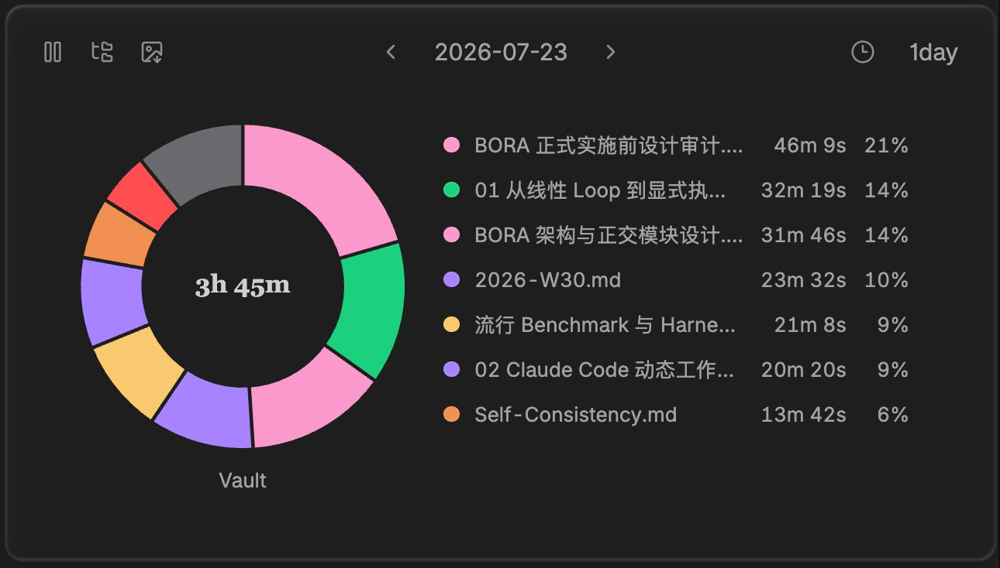
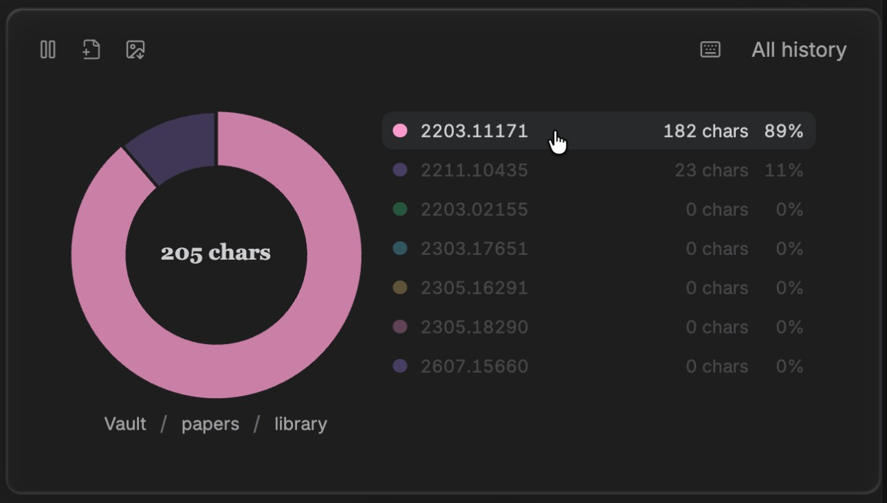

<p align="center">
  
</p>

<p align="center">
  <span style="display: inline-block; padding-bottom: 8px;">Local-first, trustworthy activity insights for your Obsidian vault.</span>
  <br />
  <a href="https://github.com/ffy6511/obsidian-activity-map/stargazers"></a>
  <a href="https://github.com/ffy6511/obsidian-activity-map/releases"></a>
  <a href="https://github.com/ffy6511/obsidian-activity-map/releases/latest"></a>
  <a href="LICENSE"></a>
</p>

<table>
  <tbody>
    <tr>
      <td width="50%"></td>
      <td width="50%"></td>
    </tr>
    <tr>
      <td align="center">Compare focused time for individual files.</td>
      <td align="center">Aggregate activity by folder, then drill into the part.</td>
    </tr>
  </tbody>
</table>

[English](#english) · [简体中文](#简体中文)

## English

Activity Map is an Obsidian plugin that shows how you spend focused time across the files and folders in your vault.

### Features

- **Trustworthy per-file activity** — Tracks active time, editing time, typed character counts, and file-open counts for the file currently in focus. Typed characters count trusted `insertText` and final IME commits by Unicode grapheme cluster; paste, drop, undo/redo, programmatic changes, and external writes are excluded.
- **Idle-aware tracking** — Stops a session at the last trusted interaction after an idle period. Short uncertain gaps can be reviewed explicitly; long sleep or lock-screen gaps stay excluded by default.
- **Explore activity by time and place** — Inspect a selected day, 7/30/90-day daily averages, all-history averages, or all-history totals. Drill from the vault root into folders, or switch to a recursive file-level view for the current path.
- **Clear visual entry point** — Eligible file headers show a compact donut chart that opens a pinnable summary popover. There is no global toolbar icon or Command Palette entry.
- **Detailed, accessible charts** — The donut chart and detail list share the same data, support keyboard interaction, retain stable colors, and keep every item available in the list even when smaller chart slices are grouped as “Other”.
- **Exportable data posters** — From the summary popover, download the current frozen result as a theme-matched Wide PNG. Edit an optional system-serif caption directly on the preview; while editing, its `0/3` visual-line indicator warns in red beyond the three exported lines. Downloads stay local and never screenshot Obsidian.
- **Local settings** — Configure excluded paths and timing thresholds. Rebuild and deletion controls will return in a later explicit header data modal.

### Install

#### 1. From Obsidian Community Plugins

In Obsidian, open **Settings → Community plugins → Browse**, search for **Activity Map**, then select **Install** and **Enable**. Disable Restricted Mode first if Obsidian asks you to do so.

#### 2. Manual installation from a GitHub Release

Alternatively, install manually from a [GitHub Release](https://github.com/ffy6511/obsidian-activity-map/releases/latest).

1. Download these three release assets:

   | File            | Purpose                  |
   | --------------- | ------------------------ |
   | `main.js`       | Compiled plugin code     |
   | `manifest.json` | Obsidian plugin metadata |
   | `styles.css`    | Plugin styles            |

2. Create this folder in your vault:

   ```text
   <vault>/.obsidian/plugins/activity-map/
   ```

   If your vault uses a custom Obsidian configuration directory, replace `.obsidian` with that directory name.

3. Copy all three downloaded files into that `activity-map` folder.
4. Reload Obsidian, then enable **Activity Map** under **Settings → Community plugins**.

> Requires Obsidian 1.7.2 or later.

### Local development

Requirements: Node.js 20.11+ and npm.

```bash
npm install
npm run dev
```

`npm run dev` watches the source and writes `main.js` at the repository root. Copy `main.js`, `manifest.json`, and `styles.css` to your development vault’s `plugins/activity-map/` folder, then reload Obsidian to test the change.

### Data and privacy

Activity Map is local-first. It does not itself upload, sync, sell, or send your activity data anywhere.

- No account, telemetry, analytics, remote API, or network upload is included.
- Activity records stay in the plugin data directory inside your vault configuration directory.
- The plugin stores activity metadata such as file identity, file path at the time of an event, timestamps, durations, open counts, and content-free typed-character counts so it can show and rebuild your statistics.
- It does not read or store note content, selected text, or the actual strings you type.
- Speech dictation, assistive technology, and tools that emit trusted keyboard-style input can be included when the browser reports them as `insertText`; the plugin uses event metadata, not content, to make that boundary.
- A poster contains only the current aggregate query result, selected optional caption, and bundled wordmark; the visible Wide PNG download stays on your device.

### License

[MIT](LICENSE)

---

## 简体中文

Activity Map 是一款本地优先的 Obsidian 活动统计插件。它帮助你了解自己在 vault 各文件和目录上的专注投入.

### 功能

- **可信的逐文件活动统计**：记录当前聚焦文件的活动时长、编辑时长、输入字符数和打开/切入次数；输入字符按 Unicode grapheme cluster 统计可信 `insertText` 与 IME 最终提交，粘贴、拖放、撤销/重做、程序化修改和外部写入不会计入。
- **识别空闲与休眠**：空闲后会在最后一次可信交互时结束 session。较短的未确定间隔可由你明确决定是否补计；休眠、锁屏或长时间间隔默认排除。
- **按时间与目录查看投入**：支持指定日、7/30/90 天日均、全部历史日均与全部历史总量；可以从 vault 根目录逐层下钻，也可以切换为当前路径下的递归文件视图。
- **低打扰入口**：符合条件的文件页眉会显示微型环形图，点击可打开并固定统计浮层；不提供全局工具栏图标或命令面板入口。
- **清晰且可访问的图表**：环形图和明细列表使用同一份数据，支持键盘操作与稳定配色；即使图表把较小项目合并为“其他”，明细列表仍会保留全部项目。
- **可导出的数据海报**：从统计浮层可将当前冻结结果下载为匹配当前主题的 Wide PNG。可直接在预览中编辑最多三行的系统衬线说明文字；编辑时显示 `0/3` 视觉行数提示，超过三行时变红。下载留在本地，不会截取 Obsidian 页面。
- **本地设置**：可设置排除路径和时间阈值。重建和删除控制将在后续显式页眉数据 modal 中提供。

### 安装

#### 1. 从 Obsidian 插件市场安装

在 Obsidian 中打开 **设置 → 第三方插件（Community plugins）→ 浏览**，搜索 **Activity Map**，然后点击 **安装** 并 **启用**。如果 Obsidian 提示，请先关闭受限模式（Restricted Mode）。

#### 2. 从 GitHub Release 手动安装

也可以从 [GitHub Release](https://github.com/ffy6511/obsidian-activity-map/releases/latest) 手动安装。

1. 下载 Release 中的三个文件：`main.js`、`manifest.json` 和 `styles.css`。
2. 在 vault 中创建目录：

   ```text
   <vault>/.obsidian/plugins/activity-map/
   ```

   如果 vault 使用了自定义 Obsidian 配置目录，请将 `.obsidian` 替换为实际目录名。

3. 将这三个文件全部复制到 `activity-map` 目录。
4. 重载 Obsidian，在 **设置 → 第三方插件（Community plugins）** 中启用 **Activity Map**。

> 需要 Obsidian 1.7.2 或更高版本

### 本地开发

环境要求：Node.js 20.11+、npm。

```bash
npm install
npm run dev
```

`npm run dev` 会监听源代码并在仓库根目录生成 `main.js`。将 `main.js`、`manifest.json` 和 `styles.css` 复制到开发 vault 的 `plugins/activity-map/` 目录，再重载 Obsidian 即可测试。

### 数据与隐私

Activity Map 坚持本地优先：插件自身不会上传、同步、出售或向任何地方发送你的活动数据。

- 不包含账号体系、遥测、分析服务、远程 API 或网络上传。
- 活动记录保存在 vault 配置目录下的插件数据目录中。
- 为统计与重建数据，插件会保存文件内部身份、事件发生时的文件路径、时间戳、时长、打开次数和不含内容的输入字符数等活动元数据。
- 不读取或保存笔记正文、选中文本，也不保存你实际输入的字符串。
- 系统听写、辅助技术或模拟键盘工具若被浏览器报告为可信 `insertText`，可能会被计入；插件只根据事件元数据判断，绝不读取输入内容。
- 海报只包含当前聚合查询结果、用户选择的可选说明文字和随插件打包的 wordmark；可见的 Wide PNG 下载只在本机生成和保存。

### 许可证

[MIT](LICENSE)
