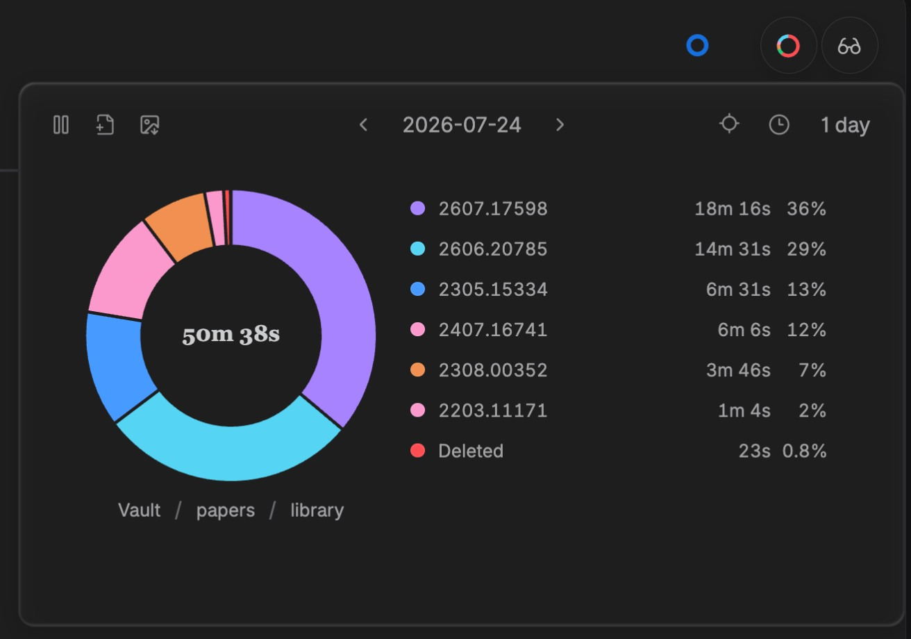
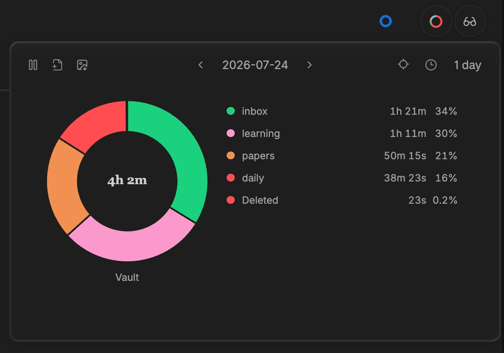
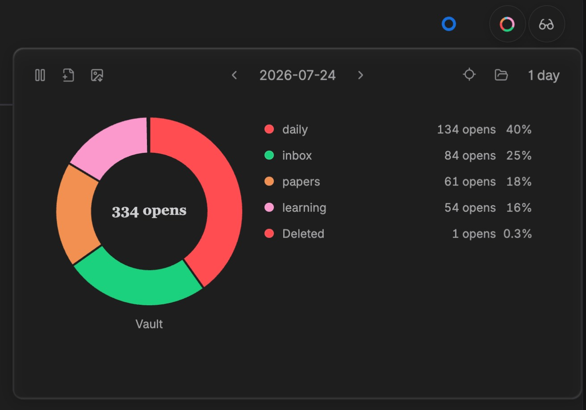
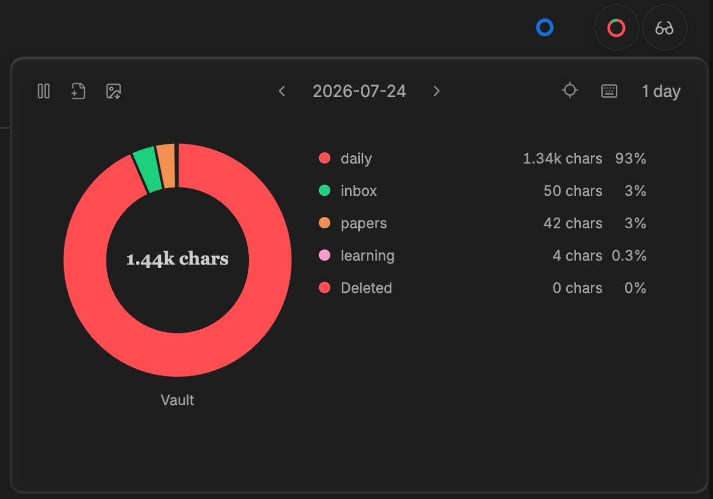

<p align="center">
  
</p>

<p align="center">
  <span style="display: inline-block; padding-bottom: 8px;">Local-first, trustworthy activity insights for your Obsidian vault.</span>
  <br />
  <a href="https://github.com/ffy6511/obsidian-activity-map/stargazers"></a>
  <a href="https://github.com/ffy6511/obsidian-activity-map/releases"></a>
  <a href="https://github.com/ffy6511/obsidian-activity-map/releases/latest"></a>
  <a href="LICENSE"></a>
</p>

## Screenshots

<table>
  <tbody>
    <tr>
      <td width="50%"></td>
      <td width="50%"></td>
    </tr>
    <tr>
      <td align="center">Compare focused time for individual files.</td>
      <td align="center">Aggregate activity by folder, then drill into files.</td>
    </tr>
    <tr>
      <td width="50%"></td>
      <td width="50%"></td>
    </tr>
    <tr>
      <td align="center">Review file-open counts.</td>
      <td align="center">Inspect typed characters.</td>
    </tr>
  </tbody>
</table>

[English](#english) · [简体中文](#简体中文)

## English

Activity Map is an Obsidian plugin that shows how you spend focused time across the files and folders in your vault.

### Features

- **Per-file activity** — Tracks active time, editing time, typed characters, and file-open counts for the file currently in focus.
- **Idle-aware tracking** — Excludes idle, sleep, and lock-screen gaps from focused activity.
- **Explore by time and place** — Inspect daily and historical activity, then drill from folders into files.
- **Header summary** — Open a compact, pinnable activity chart from eligible file headers. Reorder, move between either side of the fixed day navigation, or recoverably disable its six action controls in Settings or by long-pressing a control in the popover; the chart remains visible during direct editing. Locate follows the current workspace file; any present-file slice first locates its row, a second click opens it, and Cmd/Ctrl-click opens a new tab immediately. File opening pins the chart for continued exploration.
- **Local poster export** — Download the current result as a theme-matched PNG poster with an optional caption.
- **Local settings** — Configure excluded paths, timing thresholds, and the Header Popover control row; editing the row does not customize the poster-export dialog.

### Install

#### 1. From Obsidian Community Plugins

In Obsidian, open **Settings → Community plugins → Browse**, search for **Activity Map**, then select **Install** and **Enable**. Disable Restricted Mode first if Obsidian asks you to do so.

#### 2. Manual installation from a GitHub Release

Alternatively, install manually from a [GitHub Release](https://github.com/ffy6511/obsidian-activity-map/releases/latest).

1. Download these three release assets:

   | File            | Purpose                  |
   | --------------- | ------------------------ |
   | `main.js`       | Compiled plugin code     |
   | `manifest.json` | Obsidian plugin metadata |
   | `styles.css`    | Plugin styles            |

2. Create this folder in your vault:

   ```text
   <vault>/.obsidian/plugins/activity-map/
   ```

   If your vault uses a custom Obsidian configuration directory, replace `.obsidian` with that directory name.

3. Copy all three downloaded files into that `activity-map` folder.
4. Reload Obsidian, then enable **Activity Map** under **Settings → Community plugins**.

> Requires Obsidian 1.7.2 or later.

### Local development

Requirements: Node.js 20.11+ and npm.

```bash
npm install
npm run dev
```

`npm run dev` watches the source and writes `main.js` at the repository root. Copy `main.js`, `manifest.json`, and `styles.css` to your development vault’s `plugins/activity-map/` folder, then reload Obsidian to test the change.

### Data and privacy

Activity Map is local-first. It does not itself upload, sync, sell, or send your activity data anywhere.

- No account, telemetry, analytics, remote API, or network upload is included.
- Activity records stay in the plugin data directory inside your vault configuration directory.
- It stores activity metadata locally so it can build your statistics.
- It does not read or store note content, selected text, or the actual strings you type.
- Poster downloads are created and saved locally.

### Contributing

See [CONTRIBUTING.md](CONTRIBUTING.md) for development, validation, and pull-request guidance.

### License

[MIT](LICENSE)

---

## 简体中文

Activity Map 是一款本地优先的 Obsidian 活动统计插件。它帮助你了解自己在 vault 各文件和目录上的专注投入.

### 功能

- **逐文件活动统计**：记录当前聚焦文件的活动时长、编辑时长、输入字符数和打开/切入次数。
- **识别空闲与休眠**：空闲、休眠和锁屏间隔不会计入专注活动。
- **按时间与目录查看投入**：查看每日和历史活动，并从目录逐层下钻到文件。
- **页眉统计入口**：从符合条件的文件页眉打开可固定的紧凑活动图表；可在设置中或在浮层内长按某个控制按钮后，对六个动作排序、跨过固定的中心日期导航调整左右区域，或恢复性停用，直接编辑时图表继续显示。定位始终跟随当前激活的工作区文件。任意分组下的现存文件切片无修饰键首次点击定位列表行，再次点击在当前页面打开文件，`Cmd/Ctrl` 首次点击直接新建 tab；打开文件后图表自动固定，方便继续浏览。
- **本地海报导出**：将当前结果下载为匹配主题的 PNG 海报，并可添加说明文字。
- **本地设置**：可设置排除路径、时间阈值和 Header Popover 控制行；控制行编辑不定制海报导出 modal。

### 安装

#### 1. 从 Obsidian 插件市场安装

在 Obsidian 中打开 **设置 → 第三方插件（Community plugins）→ 浏览**，搜索 **Activity Map**，然后点击 **安装** 并 **启用**。如果 Obsidian 提示，请先关闭受限模式（Restricted Mode）。

#### 2. 从 GitHub Release 手动安装

也可以从 [GitHub Release](https://github.com/ffy6511/obsidian-activity-map/releases/latest) 手动安装。

1. 下载 Release 中的三个文件：`main.js`、`manifest.json` 和 `styles.css`。
2. 在 vault 中创建目录：

   ```text
   <vault>/.obsidian/plugins/activity-map/
   ```

   如果 vault 使用了自定义 Obsidian 配置目录，请将 `.obsidian` 替换为实际目录名。

3. 将这三个文件全部复制到 `activity-map` 目录。
4. 重载 Obsidian，在 **设置 → 第三方插件（Community plugins）** 中启用 **Activity Map**。

> 需要 Obsidian 1.7.2 或更高版本

### 本地开发

环境要求：Node.js 20.11+、npm。

```bash
npm install
npm run dev
```

`npm run dev` 会监听源代码并在仓库根目录生成 `main.js`。将 `main.js`、`manifest.json` 和 `styles.css` 复制到开发 vault 的 `plugins/activity-map/` 目录，再重载 Obsidian 即可测试。

### 数据与隐私

Activity Map 坚持本地优先：插件自身不会上传、同步、出售或向任何地方发送你的活动数据。

- 不包含账号体系、遥测、分析服务、远程 API 或网络上传。
- 活动记录保存在 vault 配置目录下的插件数据目录中。
- 插件只在本地保存构建统计所需的活动元数据。
- 不读取或保存笔记正文、选中文本，也不保存你实际输入的字符串。
- 海报只在本机生成和保存。

### 参与贡献

开发、验证和 Pull Request 说明见 [CONTRIBUTING.md](CONTRIBUTING.md)。

### 许可证

[MIT](LICENSE)
