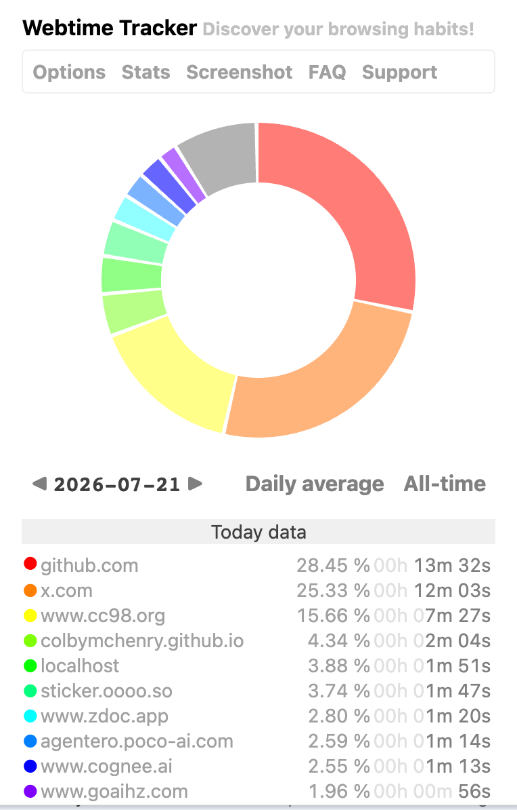

# Activity Map 产品需求文档

## 文档信息

| 字段 | 内容 |
| --- | --- |
| 产品名称 | Activity Map |
| Obsidian 插件 ID | `activity-map` |
| 文档版本 | 1.3 |
| 状态 | 已批准的产品基线 |
| 目标版本 | `v0.1` |
| 最近更新 | 2026-07-23 |
| 许可证 | MIT |

## 产品概述

Activity Map 是一个本地优先的 Obsidian 活动统计插件。它记录用户在 vault 文件上的有效活动时间，以文件作为最小记账单元，再按目录层级聚合为可下钻的环形图和明细列表。

产品需要帮助用户快速回答以下问题：

- 今天的 Obsidian 时间主要分配给了哪些项目、领域和文件？
- 最近一段时间平均每天投入多少时间，长期累计投入多少时间？
- 某个目录内部的时间由哪些下级目录或文件构成？
- 当前显示的数据是否排除了挂机、系统休眠和后台窗口时间？

所有统计默认留在本地 vault 的插件数据目录内。插件不依赖账号、云端服务或遥测系统。

## 产品原则

### 可信优先

插件只累计满足前台、可追踪文件和近期活动三个条件的时间。无法可靠归属的间隔默认排除，并允许用户通过显式修正补计。

### 逐文件记账，分层展示

原始归属保持到文件级。目录只承担查询和展示聚合，用户可以从 vault 根目录逐层下钻到任意文件。

### 默认安静

日常入口常驻但不打断写作。当前交互集中在文件页眉的环形图浮层；海报导出使用该浮层控制行打开的显式 modal，重建和删除仍保留给后续数据 modal，避免恢复一个常驻侧栏视图。

### 本地可控

用户当前能够检查自己的数据并下载当前分布的海报；重建和清除将在后续页眉数据 modal 中提供。数据保留、排除规则和时间阈值均有明确默认值。

### 指标可扩展

时间、打开次数和后续人工输入量共享日期、文件身份、目录聚合与查询基础，新增指标无需重写整个数据模型。

## 用户与核心场景

### 目标用户

主要用户是长期在 Obsidian 中阅读、写作和维护多个项目目录的个人用户。他们关心时间投入的结构，希望获得可靠趋势，同时不希望手动启动和停止每个计时器。

### 核心场景

1. 用户打开当天统计，从 vault 根目录查看各一级目录的时间占比。
2. 用户点击 `projects/`，继续查看其子目录和直属文件的分布。
3. 用户切换到“日均（近 30 天）”，比较近期投入结构。
4. 用户离开设备后返回，插件提示一段待处理间隔；用户接受默认排除或主动补计。
5. 用户在浮层明细中核对某个文件的活动时间、编辑时间和打开次数。

## 目标与范围

### `v0.1` 目标

- 自动统计前台 Obsidian 窗口中活动文件的可信活动时间。
- 支持指定日、滚动日均和全部历史三类时间视图。
- 支持从 vault 根目录到文件的逐级下钻、明细核对和稳定颜色映射。
- 提供页眉微型环形图和可固定的交互式环形图浮层，作为唯一的产品交互入口。
- 支持本地持久化和数据保留；导出、汇总重建与清除的用户界面迁移至后续页眉数据 modal。
- 桌面端和移动端均通过点击页眉入口查看数据；hover 仅作为桌面增强。

### 后续范围

- `v0.2` 的 `typedChars`：可信文本输入与 IME 最终提交的字符统计。
- `v0.2` 的当前数据海报：可编辑可选说明文字的 SVG、PNG 或 JPEG 下载。
- 删除字符数、编辑 burst 细分和更多人工工作量指标。
- 多设备冲突诊断、去重和显式合并策略。
- 按事件发生时路径分析历史。
- 更丰富的趋势图、对比区间和自定义报表。
- 在页眉数据 modal 中提供原始导出、SVG 导出、汇总重建与删除数据控制。

### 非目标

- 追踪浏览器网站、其他桌面应用或系统级屏幕时间。
- 根据文件修改时间、Git 提交或最终文本差异推断人工工作量。
- 对用户是否正在阅读、理解或思考作出确定性判断。
- 首版提供团队账号、服务端同步、排行榜或远程遥测。
- 首版统计 Agent、插件或外部程序批量写入的字符数。

## 指标定义

### 活动时间 `activeMs`

活动时间是可归属给某个文件的有效前台时长。某一时刻必须同时满足以下条件：

1. Obsidian 的一个窗口获得操作系统焦点。
2. 该窗口的活动 leaf 显示 vault 中可追踪的 file-backed view。
3. 用户尚未超过空闲阈值，或刚产生新的可信活动信号。
4. 插件未被手动暂停。

多窗口环境中，同一时刻最多有一个文件获得时间。后台窗口、无文件视图、设置页和插件内部页面不获得时间。

### 编辑时间 `editingMs`

编辑时间表示活动 session 内存在编辑行为的时间片，并始终满足 `editingMs <= activeMs`。符合条件的编辑信号开启或延长一个编辑 burst；默认在连续 15 秒没有新编辑后结束，且不得跨越文件切换、空闲、失焦、暂停或 session 结束边界。

程序化编辑可以形成编辑时间，因为它确实改变了当前编辑器状态；它不能因此计入人工输入字符数。设置中允许将编辑静默阈值调整为 5–120 秒。

### 打开次数 `openCount`

当一个文件从其他文件或不可追踪视图切换为当前前台活动文件时，`openCount` 增加一次。Obsidian 失焦后重新回到同一文件不会重复增加；同一文件在多个 leaf 之间切换且成为新的活动 leaf 时增加一次。

界面文案使用“打开/切入次数”，避免将该指标误解为文件系统层面的创建或读取次数。

### 交互输入字符 `typedChars`

`typedChars` 是与 `editingMs` 并列的独立统计指标：它只记录符合条件的输入数量，不保存输入内容。其正式语义如下：

- 计入用户界面产生的 `insertText` 和 IME composition 最终提交。
- 排除粘贴、拖放、自动填充、撤销/重做、程序化编辑和外部文件修改。
- 按 Unicode grapheme cluster 计数，正确处理中文、组合字符和 emoji。
- 删除量独立记录，不从输入量中抵扣。
- 系统听写、辅助功能和真正模拟键盘的自动化可能无法完全区分，帮助文档必须说明该边界。

## 时间归属与空闲规则

### 活动信号

可信活动信号包括受信任的键盘输入、IME、指针按下与移动、滚轮、触摸、编辑器变更、活动 leaf 切换以及窗口重新获得焦点。实现应优先检查浏览器事件的 `isTrusted`，避免程序主动派发的 DOM 事件刷新空闲时间。

### 默认空闲行为

- 默认空闲阈值为 180 秒，可在 30–1800 秒范围内调整。
- 达到阈值时，session 结束时间回拨到最后一次可信活动信号。
- 最后活动点到恢复时刻之间的整段间隔默认不计入。
- 空闲、失焦、锁屏和系统休眠均不能让 session 继续增长。

严格裁剪会低估长时间静止阅读，因此插件提供明确的补计流程，不通过默认多算来掩盖不确定性。

### 空闲恢复

- 间隔不超过 30 分钟时，恢复后显示非阻塞的待处理提示，默认操作为排除。
- 用户可以选择补计全部间隔，或保持排除；决定保存为独立修正记录。
- 待处理提示不阻塞新的 session，新活动从恢复时刻正常累计。
- 间隔超过 30 分钟时自动排除，并提供短暂撤销入口。
- 锁屏、系统休眠和唤醒形成的间隔默认自动排除。

### 跨日与时区

- 统计日使用事件发生时的系统本地时区和自然日边界。
- 跨午夜 session 必须按本地午夜切分，但真实持续时间仍由时间戳差值计算。
- 用户之后改变时区不会重写既有日期分片。
- 夏令时跳变按系统时间规则处理，不假设每个自然日恒为 24 小时。

## 文件范围与身份

### 可追踪文件

- 跟踪所有由 file-backed view 打开的 vault 文件，包括 Markdown、Canvas、PDF、图片、音频等 Obsidian 可展示文件。
- `editingMs` 只适用于能够提供编辑信号的文件类型。
- 设置支持 vault 相对路径 glob 排除规则。
- Obsidian 配置目录、Activity Map 插件目录和插件内部数据始终排除，不能被用户取消排除。

### 稳定身份

- 每个首次观察到的文件获得插件内部 `fileId`。
- 插件不得为统计目的修改笔记 frontmatter 或文件正文。
- 每条事件保留 `fileId` 与 `pathAtEvent`。
- 插件观察到重命名或移动事件时更新当前路径映射，历史默认跟随文件的当前路径聚合。
- 插件关闭期间发生且无法可靠匹配的移动可能表现为“旧文件已删除 + 新文件首次出现”；插件不得使用高风险猜测静默合并身份。
- 删除文件的历史保留在“已删除”分组中，并显示最后已知路径，直至用户手动清理或重新关联。

## 查询与聚合

### 时间范围

完整视图提供以下模式：

| 模式 | 定义 | 默认行为 |
| --- | --- | --- |
| 指定日 | 用户本地时区中的某个自然日 | 首次打开为今天，可前后切换 |
| 日均 | 选定滚动自然日范围的总量除以分母天数 | 默认近 30 天，另有 7/90 天和全部历史 |
| 全部历史 | 从第一条有效记录到查询时刻的累计总量 | 显示数据覆盖起止日期 |

日均包含零使用日。插件安装或首次记录不足所选窗口时，分母从第一条记录日期到今天计算，不虚构安装前的零数据。没有任何记录时显示空状态和 `—`，不显示容易误解的零日均。

明细可补充“活跃日平均”，但它不能替代默认自然日平均，且必须明确标注分母口径。

### 目录层级

1. 根视图展示 vault 一级子目录及根目录直属文件的分布。
2. 点击目录切片进入该目录，并展示下一级子目录。
3. 当前目录的直属文件聚合为“本层文件”虚拟切片；点击后展示这些文件。
4. 当前目录没有子目录时，环形图直接展示文件。
5. 面包屑允许返回任意祖先路径。
6. 文件条目可打开对应文件，并提供独立指标详情。

每个下钻视图同时显示：

- 当前范围的总量；
- 当前目录占 vault 同期总量的比例；
- 每个切片在当前目录内部的比例。

这三类数值用于避免用户把局部视图的 100% 误读为全 vault 的 100%。

### 小项与“其他”

- 环形图默认绘制数值最高的 8 个项目，其余项目合并为“其他”。
- 明细列表始终保留全部项目，不因图表合并而丢失。
- “其他”是查询结果，可展开为过滤列表，不能作为真实目录参与面包屑或文件身份。
- 颜色由稳定身份确定，同一目录或文件在日期和范围切换后保持一致；“本层文件”“其他”和“已删除”使用固定语义颜色。

## 信息架构与交互

### 产品入口

桌面端只在可追踪文件页眉提供一个微型环形图入口。hover 或键盘 focus 打开环形图浮层；点击页眉按钮固定或取消固定该浮层。控制行从左到右显示分组切换、暂停/恢复和导出海报；导出位于暂停/恢复右侧。移动端依赖点击打开同一入口，不要求 hover。

页眉集成优先使用 Obsidian 公开 API。公开接口无法覆盖时，DOM 适配必须隔离、可检测失败，并报告不可用状态；首版不提供左侧工具栏、命令面板或可停靠完整视图作为替代入口。

### 页眉微型环形图

页眉入口保持同一个稳定的环形外框，不能随 tracking snapshot 在多个图标之间反复替换或闪烁。内圈是当天 vault 根目录分布的微缩版本：切片身份、颜色和占比与打开浮层后看到的根目录环形图一致。尚无数据、查询失败或初始化期间只显示固定空环，不绘制单色伪造比例。

微型环形图保留同一个 SVG 根节点，并按稳定切片身份复用节点；只在当天汇总或当前活动累计使分布实际改变时更新几何。活动、空闲、待处理、暂停、不可追踪和存储异常通过稳定的可访问名称、tooltip、CSS 状态和必要的非闪烁语义标记表达，不能替换主图形。

### 环形图浮层

浮层是非模态的主要统计入口，默认显示今天的 vault 根目录，并使用统一的查询和图表语义。控制行位于顶部，其余内容使用水平居中的 `2:3` 双列：左侧放置紧凑边界的图表，右侧放置图例列表；结果容器左右内边距相等，两个区域只承担布局，不显示“图表区”“列表区”等额外标题。主体固定为：

- 单行指标和范围控件；指定日模式使用“前一天—`YYYY-MM-DD`—后一天”日期组，日期文字可以打开日期选择器；
- 与日期组保持明显间距、但尺寸一致的暂停/恢复 tracking 图标；
- 紧接暂停/恢复右侧的导出海报图标；
- 位于暂停/恢复图标左侧的分组切换按钮；默认按路径层级聚合，切换后在当前路径范围内递归显示全部现存文件，且不改变指标、时间范围或路径范围；
- 左侧 Webtime Tracker 参考形态的交互式环形图，以及位于环形图下方、初始值为 vault 根路径的当前路径；
- 右侧图例列表，按“颜色、名称、精确值、百分比”排列；百分比固定在最右侧；列表最大高度不超过环形图高度，超出后只滚动列表。

路径是独立的上下文信息，不使用列表项背景；默认以次要文字色在环形图下方居中显示。Popover 中当前路径和祖先路径均可点击，hover/focus 时增加下划线并切换为主要文字色。图例行增加足够的左侧内边距且默认没有背景，名称、精确值和百分比均使用次要色；文件叶子只显示文件名本身，完整 vault 相对路径继续用于身份与打开文件。名称超过可用列宽时以 `…` 截断，不能进入右侧数值区域。hover/focus 某项或 hover/focus 对应饼图切片时，将该行全部文字提升为主要色，并以短缓动降低其余列表项和切片的透明度；离开时使用对应的淡出恢复，系统要求减少动态效果时取消过渡。文件项通过 Obsidian Page Preview 的公开接口提供默认需要 `Cmd/Ctrl` 的原生悬浮预览；预览不打开文件 leaf，指针进入原生预览后继续保留来源 Popover，离开两者后再按原延迟关闭。普通激活仍需可信主键点击或键盘操作。精确值使用固定宽度右对齐，百分比使用固定宽度在最右侧右对齐，避免秒、分钟或小时格式导致列错位。

分组切换属于查询展示状态，但最后一次成功选择写入插件设置。首次使用默认按路径；关闭后重新打开浮层或重启插件时恢复已保存的 path/file 模式。按路径模式保留现有目录下钻和“本层文件”语义；按文件模式保留当前 breadcrumb 作为范围，在该范围内将所有现存后代文件扁平显示为独立明细项，并继续使用现有 top-N/“其他”折叠。相同路径、时间范围和指标在两种模式下必须保持相同的 scope total 与 vault total；历史删除数据继续通过不可激活的“已删除”项呈现。设置写入失败时回滚该次选择，不允许未持久化状态成为下一次打开时的默认值。

浮层不显示标题栏、重复的指标/总量/vault 占比汇总、图表下方的临时 tooltip 行或普通 tracking 状态页脚。环形图中心总量必须以水平和垂直中心对齐，并使用衬线字体与周围界面文字形成层级。hover 或键盘 focus 切片时只同步高亮切片与现有图例行，不能增删布局节点。打开浮层期间，今天的活动时长每秒投影当前未关闭 session，无需等待 summary 落盘或 30 秒 heartbeat；实时 tick 只原位更新切片几何、中心时长、百分比和列表数值，保留现有 DOM 与 hover/focus 状态。增长最多到最后一次可信活动加空闲阈值，不得将无人操作时间计为活动。点击目录切片在浮层内进入下一级；“本层文件”“其他”“已删除”和文件条目遵循统一的查询激活规则。日期或范围切换保留当前路径。指标选择器可以使用随指标变化的语义图标，图标与文字之间保留可见间距。所有可点击按钮、切片、图例行和路径在 pointer 环境中使用手型 cursor。

指针或焦点进入浮层后保持打开；点击页眉按钮切换固定状态。未固定浮层在指针与焦点离开后延迟关闭；固定浮层只在再次点击页眉按钮、`Escape` 或外部点击时关闭。暂停/恢复保留为控制行的单个图标；恢复决策和普通 tracking 状态留在设置或后续页眉数据 modal 中，不占用浮层空间。当前浮层的所有操作都提供键盘等价入口。

### 海报导出 modal

点击导出图标会打开一个独立 modal，不出现二级确认 modal。modal 的主区域是较大的完整海报预览，导出使用与预览相同的已冻结查询数据和图表模型，不截取 Obsidian 页面或 Popover DOM。用户可选择 `Portrait`、`Wide` 或 `Compact` 三种排版，选择 `SVG`、`PNG` 或 `JPEG` 格式，并在预览底部正中直接输入可选说明文字；默认文字为空，不提供候选总结。点击“导出”后自动开始一次本地下载。

海报显示 Activity Map wordmark、指标、日期或范围、当前路径、总量、环形图、明细与百分比。wordmark 当前使用随插件打包的 PNG，未来替换为 SVG 不改变用户界面或输出选择。所有用户输入和路径文字必须被转义；导出不得包含笔记正文、已输入的实际文字、选区、剪贴板数据或截图。

### 后续数据 modal

当前版本不注册可停靠完整视图，也不提供命令面板入口。后续 Spec 将以显式页眉数据 modal 承载原始 JSON、汇总重建和删除控制；该 modal 必须复用浮层的查询状态、`ChartModel`、切片颜色、图例和激活规则，并在破坏性操作前显示范围、不可恢复性和明确确认。

### 环形图

环形图沿用 Webtime Tracker 的占比、hover、点击和图例关系，并针对目录下钻增加以下约束：

- hover、键盘 focus 或点击均能显示名称、百分比和精确时长；
- 目录切片可以进入下一级，文件切片可以打开详情；
- 图例颜色与切片严格一致；
- 百分比、精确值和排序同时出现在明细列表中；
- 无数据时显示解释性空状态，不绘制伪造的 100% 占位切片。

### Obsidian 页眉参考

页眉入口参考 Minidoro 的低干扰形态和可交互浮层。Activity Map 使用 Obsidian 主题变量、标准图标尺寸和组件间距，不复制参考图的固定颜色、字体或内部 DOM 实现。

## 海报导出

当前 Header Popover 提供完整海报下载。导出器针对当前查询提供三种布局的 SVG，并从同一 SVG 渲染 PNG 或 JPEG：

### Portrait

默认纵向报告布局，包含产品 wordmark、日期或范围、当前路径、指标名称、总量、环形图、图例、百分比、精确数值和可选说明文字。按钮、tooltip、hover 高亮等运行时控件不进入文件。

### Wide 与 Compact

Wide 使用横向摘要布局，Compact 使用紧凑卡片布局；两者保留完整图表数据和可选说明文字，不提供只导出环形图的模式。

三种布局的 SVG 均需满足：

- 独立内联颜色和必要样式，离开 Obsidian 后仍可阅读；
- 包含 `<title>` 与 `<desc>`；
- 明暗主题下具备可读对比度；
- 文件名包含指标、范围、路径和布局的安全化摘要；
- 导出过程不得写入或上传原始笔记内容。

## 设置与数据控制

### 默认设置

| 设置 | 默认值 |
| --- | --- |
| 追踪状态 | 开启 |
| 空闲阈值 | 180 秒 |
| 可提示补计的最大间隔 | 30 分钟 |
| 编辑 burst 静默阈值 | 15 秒 |
| 日均窗口 | 30 个自然日 |
| 原始 session 保留期 | 90 天 |
| 逐日汇总保留期 | 永久，直到后续数据 modal 提供清除操作 |
| 环形图最大独立切片数 | 8 |
| 网络与遥测 | 关闭且首版不提供开启项 |

### 用户控制

当前版本提供设置中的排除路径与时间阈值，以及浮层中的暂停和恢复。原始 JSON、SVG、重建和删除控制不在 header-only 界面中暴露，后续页眉数据 modal 必须在破坏性操作前显示范围、不可恢复性和明确确认。

## 数据与隐私要求

- 设置与时间序列分层保存，详细布局见[产品与数据决策](../specs/constitution/2026-07-21-activity-map-product-and-data.md#technical-boundaries)。
- 已完成 session 按设备和日期分片，降低频繁重写和多设备同文件冲突风险。
- 原始 session 默认保留 90 天，逐日汇总永久保留；清理原始数据前必须确保对应汇总已成功持久化。
- 数据格式预留 `deviceId`。首版允许多个设备分片共存，不承诺冲突去重或自动判断同时使用造成的重复时间。
- 插件不得收集文件正文、选中文本或输入内容；字符指标只保存数量和必要来源分类。
- 插件不得发起产品遥测或数据上传请求。
- 单条损坏记录不能阻断其他日期的加载；界面需要报告受影响范围，后续数据 modal 提供重建或导出诊断入口。

## 平台、适配与可访问性

### 平台范围

- 计时核心只使用 Obsidian 公开 API、标准 Web API 和跨平台时间源。
- 桌面端承担完整追踪、空闲恢复、页眉浮层、统计与海报导出能力；重建和删除等待后续页眉数据 modal。
- 移动端至少能够加载数据、切换范围、下钻和查看明细；移动端采集、海报导出和后续数据 modal 能力按可获得的前台、输入和文件 API 逐项验证。
- `manifest.json` 保持 `isDesktopOnly: false`，任何桌面专用增强必须通过能力检测隔离。

### 可访问性

- 所有 hover 内容都提供 focus、点击或固定视图等价入口。
- 环形图切片支持 Tab 聚焦以及 Enter/Space 激活。
- 颜色不能成为唯一编码；名称、百分比和时长始终以文本呈现。
- 焦点顺序与视觉顺序一致，浮层关闭后焦点回到触发按钮。
- 尊重 Obsidian 明暗主题和 `prefers-reduced-motion`。
- 状态变化使用 `aria-live` 的克制提示，不能持续朗读实时秒数。

## 异常与边界行为

| 场景 | 预期行为 |
| --- | --- |
| Obsidian 窗口失焦 | 立即结束可归属区间，不累计后台时间 |
| 多个 Obsidian 窗口 | 只归属当前获得系统焦点窗口中的活动文件 |
| 系统休眠或锁屏 | session 裁到休眠前最后活动点，间隔自动排除 |
| 定时器被系统节流 | 依据单调时间和事件时间戳结算，不能把延迟回调间隔全部计入 |
| 切到设置页或无文件视图 | 结束当前文件归属，进入不可追踪状态 |
| 文件跨午夜保持活动 | 在本地午夜拆分记录，总持续时间保持一致 |
| 文件重命名或移动 | 已知 `fileId` 保持不变，历史按当前路径展示 |
| 文件删除 | 历史进入“已删除”，不静默丢弃 |
| 路径被新增到排除规则 | 后续停止采集；历史默认保留，后续数据 modal 可提供清除 |
| 汇总文件缺失或损坏 | 从保留期内原始 session 重建，并标记无法重建的历史范围 |
| 设备分片冲突 | 保留各设备原始证据并显示诊断，禁止静默覆盖 |
| 插件禁用或卸载 | 停止监听和计时，不删除既有数据 |

## 发布验收

`v0.1` 只有在以下条件全部满足后才能标记完成：

> 当前证据边界（2026-07-22）：受控时钟、持久化、固定查询、path/file 分组、SVG、无障碍源码约束、隐私源码约束、生产 bundle 与 fake-adapter 纵向旅程已自动验证。Spec 05 的独立 Critic 与 owner 实机分组切换验收仍待完成；此前 `v0.1` 三轮联合 Critic 的最终审查、完整真实 Obsidian 桌面旅程与移动端查看旅程也仍未完成，因此 `v0.1` 仍是开发候选。

### 计时正确性

- 自动化时钟测试覆盖前台、失焦、切换文件、空闲裁剪、恢复补计、暂停、休眠延迟和跨午夜。
- 任意时刻最多一个文件获得 `activeMs`，测试不存在双重归属。
- `editingMs` 永不超过对应 `activeMs`。
- 时间计算内部使用毫秒，界面显示到秒；受控测试中聚合误差不超过 1 秒。

### 数据可靠性

- session、修正记录、逐日汇总和文件身份能够在重启后恢复。
- 损坏单行、缺失汇总和中断 checkpoint 均有可测试恢复路径。
- 90 天清理不会删除尚未成功汇总的数据。
- 本地 JSON 导出、选择性清除和全部清除服务经过范围与失败测试；它们尚未注册为用户入口。

### 查询与交互

- 指定日、7/30/90 日均和全部历史结果与固定数据集的期望值一致。
- 根目录、子目录、“本层文件”、“其他”和“已删除”的下钻结果可复核。
- 页眉与浮层形成完整桌面用户旅程；不显示全局工具栏或命令面板入口。
- 移动端无需 hover 即可完成查看、下钻和范围切换。
- 键盘能够访问全部核心操作，文本与颜色对比通过自动检查和人工抽查。

### 海报导出与隐私

- Header Popover 的 Portrait、Wide 与 Compact 海报可分别下载为 SVG、PNG 或 JPEG；SVG 能由标准解析器打开，且包含可访问标题与描述。
- 离线运行时不存在产品遥测、远程账号或数据上传依赖。
- 导出和运行日志不包含笔记正文、选中文本或真实输入内容。

### 工程与文档

- 类型检查、lint、单元测试、生产构建和规格工作区严格验证全部通过。
- README、PRD、Constitution、Roadmap、Active Spec 和用户设置文案保持一致。
- 独立 Critic 对实现与证据给出 `pass`，或在无阻塞问题时给出带明确后续版本归属的 `pass-with-follow-ups`。
